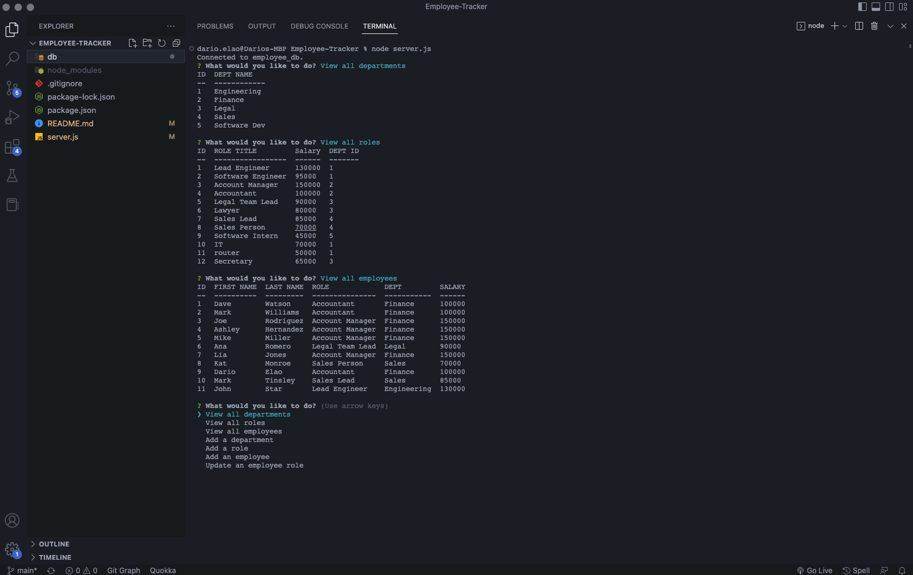
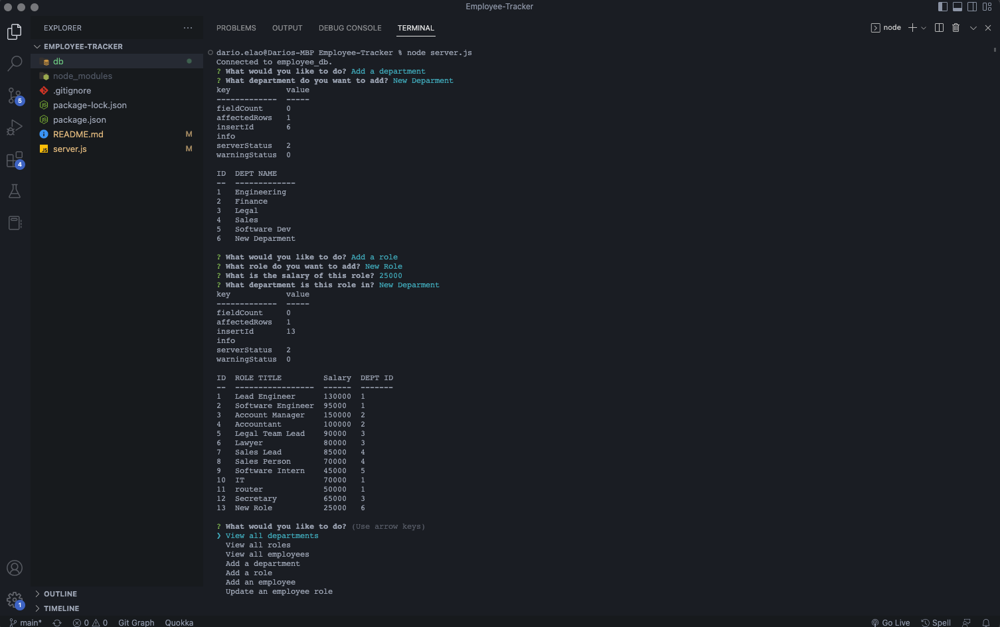
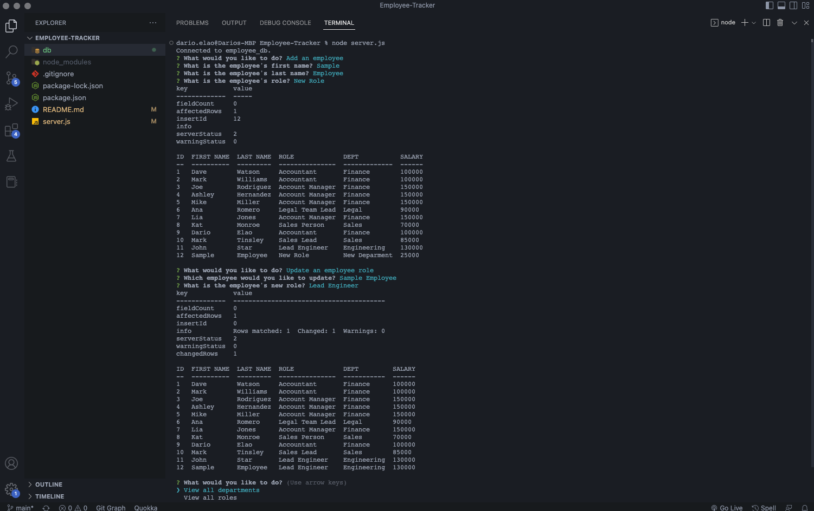

# Employee-Tracker

## Description:
This app is designed to manage employees information saved in a Database. The app allows the user to view departments, roles & employees. The user also has the capability of adding a new department, role and employee, as well as updating employees role. The application was created with SQL and Node.JS

## Table of content:
1. [Installation](#installation)
2. [Usage](#usage)
3. [Username](#username)
4. [Email](#email)

## Installation:
1. Create a database with name "employee_db" and create the tables with the .sql files inside the "db" folder
2. Open the server.js file in your terminal with the command: 'node server.js'
3. Choose an option from the prompt to view the specific data

## Usage:

#### Sample image displaying all departments, roles and employees

#### Sample image displaying how to add department and role

#### Sample image displaying how to add and update and employee

## License
  None

## Github Username:
  https://github.com/darioelaoao

## Email:
  darioelao@gmail.com